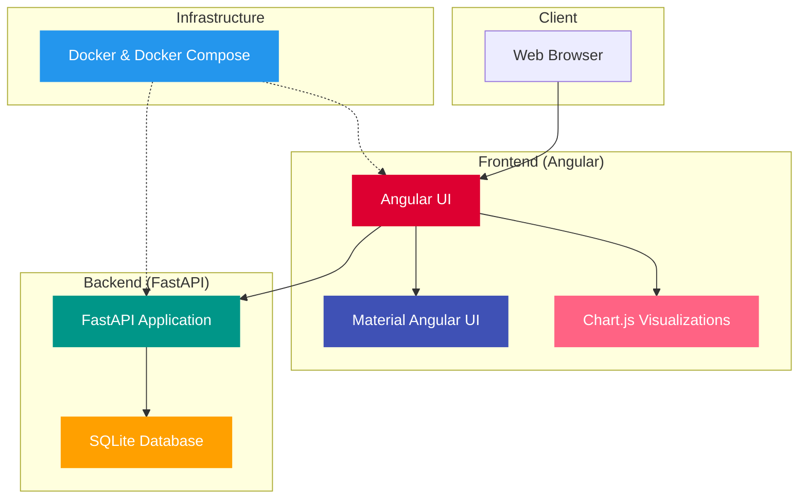

# Oil Production Analytics Platform Architecture

## System Architecture Diagram

## Component Descriptions

### Frontend (Angular)

1. **Angular UI**: The main frontend application built with Angular 17.
   - Provides user interface for data visualization and interaction
   - Includes dashboard, wells listing, production data views, and map visualization

2. **Material Angular UI**: UI component library providing consistent design elements.
   - Used for all UI components as per project requirements
   - Provides responsive design for various screen sizes

3. **Chart.js Visualizations**: Library for creating interactive charts.
   - Used for all data visualizations as per project requirements
   - Includes line charts for oil production trends
   - Provides map visualization for well locations

### Backend (FastAPI)

1. **FastAPI Application**: Main backend application.
   - Provides RESTful API endpoints for wells and production data
   - Handles data processing and business logic
   - Manages database operations

2. **API Routes**:
   - **/api/wells**: Endpoints for well data (GET, POST)
     - GET /api/wells/: List all wells
     - GET /api/wells/{well_id}: Get specific well details
     - GET /api/wells/region/{region}: Get wells by region
     - POST /api/wells/: Create a new well
   - **/api/production**: Endpoints for production data (GET, POST)
     - GET /api/production/: List all production records
     - GET /api/production/{production_id}: Get specific production record
     - GET /api/production/well/{well_id}: Get production data for a specific well
     - POST /api/production/filter/: Filter production data by date, well, or region

3. **Services & Data Models**:
   - **Models**: SQLAlchemy ORM models for Well and Production data
   - **Services**: Business logic for data processing and database operations
   - **Database Initialization**: Sample data generation for testing

4. **SQLite Database**: Persistent data storage.
   - Stores well information and production data
   - File-based database for easy deployment
   - Managed through SQLAlchemy ORM

### Infrastructure

1. **Docker & Docker Compose**: Containerization and orchestration.
   - Provides consistent deployment environment
   - Manages container networking and dependencies

## Data Flow

1. User interacts with the Angular UI in their browser
2. Angular UI processes user input and makes API calls to the backend
3. FastAPI backend processes requests and performs database operations
4. SQLite database stores and retrieves data
5. Results flow back to the frontend for visualization using Material Angular and Chart.js

## Deployment Architecture

The application is containerized using Docker, with separate containers for:
- Frontend (Angular)
- Backend (FastAPI)

Docker Compose orchestrates these containers, managing networking and dependencies between them.
